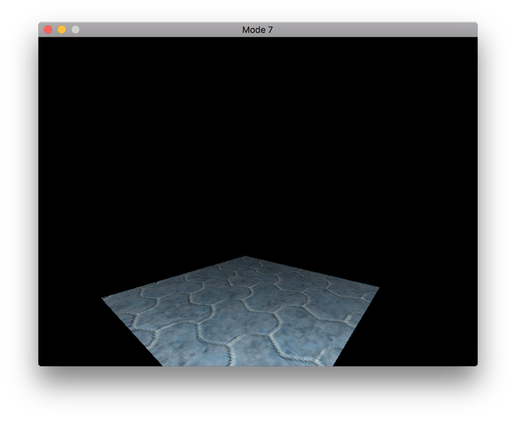

# mode-7

This is an old project I made to experiment with [Mode-7](https://en.wikipedia.org/wiki/Mode_7) which is an old-school way of doing pseudo 3D rendering.

At the time I was interested in understanding how 3D renderers work. I figured a mode7 style renderer was a good place to start.

## Mode 7 References

* [Tonc GBA Programming](http://www.coranac.com/tonc/text/toc.htm)
* [SNES Mode 7 Effect](http://gamedev.stackexchange.com/questions/24957/doing-an-snes-mode-7-affine-transform-effect-in-pygame)

## Software Rendering References

* [Coloring and Texturing of Polygons (PDF)](http://www.cs.tufts.edu/~sarasu/courses/comp175-2009fa/pdf/comp175-06-color-texture.pdf)
* [Perspective Texturing](http://www.lysator.liu.se/~mikaelk/doc/perspectivetexture/)
* [Polygon Rasterization](http://www.flipcode.com/archives/3D_Graphics_on_Mobile_Devices-Part_4_Polygon_Rasterization.shtml)
* [Ray Casting Tutorial](http://permadi.com/1996/05/ray-casting-tutorial-table-of-contents/)
* [Raycasting](http://lodev.org/cgtutor/raycasting.html)
* [Triangle Rasterization in Practice](https://fgiesen.wordpress.com/2013/02/08/triangle-rasterization-in-practice/)

## Project License

MIT License

Copyright (c) 2017 Justin Meiners

Permission is hereby granted, free of charge, to any person obtaining a copy of this software and associated documentation files (the "Software"), to deal in the Software without restriction, including without limitation the rights to use, copy, modify, merge, publish, distribute, sublicense, and/or sell copies of the Software, and to permit persons to whom the Software is furnished to do so, subject to the following conditions:

The above copyright notice and this permission notice shall be included in all copies or substantial portions of the Software.

THE SOFTWARE IS PROVIDED "AS IS", WITHOUT WARRANTY OF ANY KIND, EXPRESS OR IMPLIED, INCLUDING BUT NOT LIMITED TO THE WARRANTIES OF MERCHANTABILITY, FITNESS FOR A PARTICULAR PURPOSE AND NONINFRINGEMENT. IN NO EVENT SHALL THE AUTHORS OR COPYRIGHT HOLDERS BE LIABLE FOR ANY CLAIM, DAMAGES OR OTHER LIABILITY, WHETHER IN AN ACTION OF CONTRACT, TORT OR OTHERWISE, ARISING FROM, OUT OF OR IN CONNECTION WITH THE SOFTWARE OR THE USE OR OTHER DEALINGS IN THE SOFTWARE.

